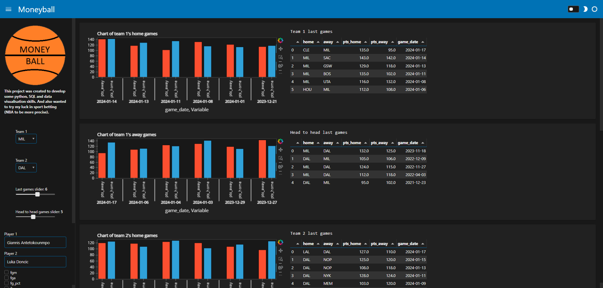
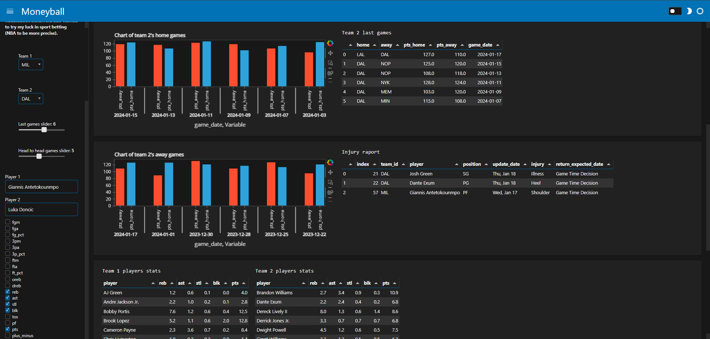
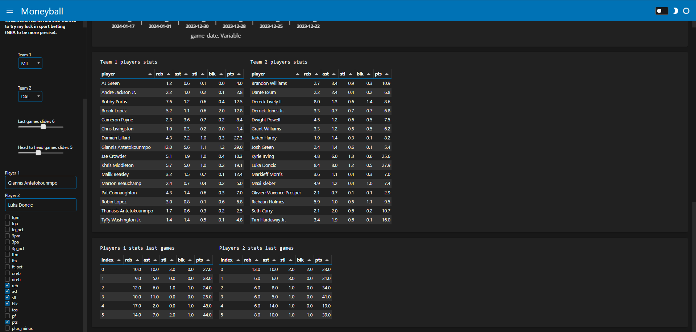

# Moneyball

This project was created for many reasons:
- to develop python, SQL and data visualisation skills,
- I have watched movie Moneyball and liked the idea to try discribe the NBA game with numbers
- I recently had an idea to start sport betting
Putting all this together, I decided to create an interactive dashboard full of game stats. Additionally I created a "software" that scraope, clean and store data. To store data I used MySQL database. To scrape data I usesd python libraries selenium and request. To clean and manipulate data I used python libraries pandas and numpy. For now dashboard can be run on computer with MySQL database on it (if you want you can easily create database and run it on your PC). 
Further plans: 
- create neural network (AI) to predict some paramiters (e.g. team score, player points, asists, rebounds)
- make website
## Acknowledgements
if you haven't seen this movie before:
 - [Moneyball - filmweb](https://www.filmweb.pl/film/Moneyball-2011-490838)

## Setup

You can create new virtual environment in folder with all project files by typing in terminal

```
python -m venv venv
```

and activate it using command:

- for Windows

```
venv\Scripts\actibate
```

- for other OSes

```
source venv/bin/activate
```

To run the project you need to install required packages, which are included in requirements.txt file

```
pip install -r requirements.txt
```
## Launch

To launch the project you have to first create MySQL database. To do that you need to run file

```
create_db.ipynb
```

## Controls/funcion

- scraper (to daily download game data and instrt into database)
- player upload (to change maniualy after players trade or to add rookies)
- dashboard (create interactive dashboard with game data, injury raport and player stats)

## Screenshots
Window part 1 

Window part 2 

Window part 3
